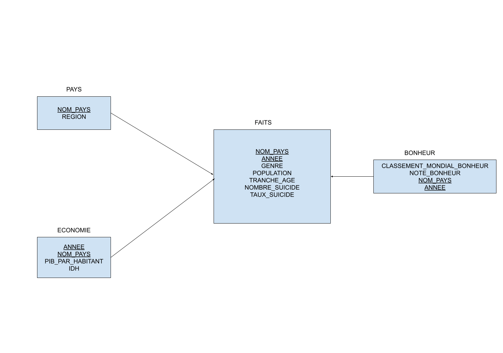

# **Bases de données évoluées - Projet 2021** #
## Etude du bien-être dans le monde en 2015 et 2016 ##

#### *Introduction* ####
Pour réaliser cette entrepôt de données nous avons parcouru différents site de Dataset notamment **Kaggle** où nous avons choisi comme sujet **“L’Etude du bien-être dans le monde en 2015 et 2016”** après avoir trouvé la base de données donnant accès à différentes informations à propos des suicides en 2015-2016 par pays et nous voulions analyser si une corrélation pouvait être trouvée entre le nombre et taux de suicide et le niveau économique des pays du monde en 2015-2016. Une analyse qui pourrait être faite par des étudiants ou des chercheurs en sciences sociales.

#### *Processus d'entreprise et grain de processus de l'entrepôt* ####
L’entrepôt de données que nous avons réalisé à pour but d’analyser les liens potentiels entre le bonheur de la population par pays et le taux de suicide et l’économie des pays en 2015 et 2016.
Pour cela nous avons utilisé des base de données qui concernent dans un premier temps le taux de suicide dans les pays ainsi qu’une autre base de données fournissant des informations sur le bonheur des gens dans les pays du monde et enfin une dernière base qui nous donne le pib (produit intérieur brut) et l’ idh (indice de développement humain) pour chaque pays.

Au niveau des données l’analyse peut être faite par année(2) et par pays de plus les données sont réparties et analysable par tranches d’âge(5) et genre(2), population dans un pays, nombre de sucide et taux de suicide. Ces composantes identifient le grain de processus de l'entrepôt de données.

#### *Schéma en étoile de l'entrepôt de données* ####


Deux dimensions (PAYS et ECONOMIE) ainsi qu'une table des faits sont représentées dans ce schéma.  

- PAYS  
**nom_pays** (chaîne de caractère) : Nom du pays en toute lettre.  
**region_geographique** (chaîne de caractère) : Région géographique du pays concerné, en toute lettre.

- ECONOMIE  
**id_economie** (entier) : clé primaire necessaire pour différencier les différents tuples.  
**PIB_par_hab** (flottant) : le PIB/habitant.  
**IDH** (flottant) : valeur numérique comprise entre 0 et 1 qui représente l'IDH.  

- FAIT  
**classement_mondial_bonheur** (entier) : la position du pays de la population étudiée au classement mondial sur l'échelle du bonheur.  
**note_bonheur** (flottant) : valeur numérique comprise entre 0 et 10 qui représente le niveau de bonheur d'un pays selon ses habitants.  
**genre** (binaire) : Le genre de la population étudiée.    
**nombre_population** (entier) : taille de la population étudiée.  
**tranche_age** (chaîne de caractère) : tranche d'âge de la population étudiée.  
**nombre_suicide** (entier) : nombre de suicide dans l'année pour la population étudiée.  
**taux_suicide** (flottant) : nombre de suicide pour 100k habitants pour la population étudiée.  
**annee** (entier) : année concernée par les données.
  
#### *Mise en oeuvre de l'entrepôt* ####

L'entrepôt de données a été implémenté en utilisant le logiciel SQLDeveloper. Seule les données concernant les années 2015 et 2016 nous intéressent.   
L'entrepôt repose sur le schéma en étoile présenté ci-dessus : il est nécessaire de respecter les différentes organisations des tables ainsi que les différents types primitifs utilisés dans le schéma.

- <u>Sources</u>
  - [1] https://www.kaggle.com/russellyates88/suicide-rates-overview-1985-to-2016  
    Ensemble de données qui regroupe des statistiques sur les suicides par pays, ainsi que les données économiques (PIB par habitant et IDH) de ces pays.

  - [2] https://www.kaggle.com/unsdsn/world-happiness  
    Ensemble de données qui regroupent des statistiques sur le bonheur des pays.

- <u>Intégration & nettoyage des données</u>  
  Le processus d'intégration est différent pour les 4 tables de l'entrepôt de données.
  - La table **PAYS**  
    La table **PAYS** est relativement aisée à remplir : il suffit d'importer les données des colonnes *Region* (renommée en **Region**) et *Country* (renommée en **NOM_PAYS**) de l'ensemble [2].
  - La table **ECONOMIE**  
    La table **ECONOMIE** est tout aussi facile à remplir : il suffit d'importer les données des colonnes *GDP_PER_CAPITA* (renommée en **PIB_PAR_HABITANT**), *HDI for year* (renommée en **IDH**), *country* (renommée en **NOM_PAYS**) et *year* (renommée en **ANNEE**) de l'ensemble [1].
  - La table **BONHEUR**  
    La table **BONHEUR**, bien que facile à remplir, nécessite une légère manipulation : il suffit d'importer les colonnes *Country* (renommée en **NOM_PAYS**), *Happiness Rank* (renommée en **CLASSEMENT_MONDIAL_BONHEUR**) et *Happiness Score* (renommée en **NOTE_BONHEUR**) de l'ensemble [2].
    La colonne **ANNEE** est remplie en fonction du fichier source : il existe plusieurs fichiers .csv dans l'ensemble de données sources, dont 2015.csv et 2016.csv qui nous intéressent. Il suffit ensuite de remplir tout les ```INSERT``` générés avec la bonne année (à l'aide d'un CTRL+F couplé d'un 'Test to Search For' et 'Replace With'), puis les exécuter.
  - La table **FAITS** est la dernière table de l'entrepôt de données. Une petite manipulation est nécessaire pour remplir la table : il suffit d'importer les colonnes *country* (renommée en **NOM_PAYS**), *age* (renommée en **TRANCHE_AGE**), *year* (renommée en **ANNEE**), *sex* (renommée en **GENRE**), *suicides_no* (renommée en **NOMBRE_SUICIDE**), *suicides/100k pop* (renommée en **TAUX_SUICIDE**) et *population* (renommée en **POPULATION**).
    Il est nécessaire de procéder à un *bitmapping* pour la colonne **GENRE** à l'aide du même procédé utilisé pour modifier les requêtes ````INSERT```` : il faut remplacer toutes les occurrences de "female" par 0 et toutes les occurrences de "male" par 1.

Les multiples instructions énoncées ci-dessus permettent de reproduire l'entrepôt de données du projet.

#### *liste des requêtes* ####
- Group By
```sql
SELECT NOM_PAYS, SUM(NOMBRE_SUICIDE), SUM(POPULATION), AVG(TAUX_SUICIDE) as TX_SC 
FROM FAITS
GROUP BY NOM_PAYS
ORDER BY TX_SC DESC;
```
Affiche les pays avec les taux de suicide (pour 100 000 habitants) les plus élevées en premier (pour 2015-2016).
Cela donne un ordre de grandeur pour la suite des calculs.


- Group By Rollup
```sql
SELECT ANNEE, NOM_PAYS, SUM(POPULATION) AS POPULATION_TOTALE, GROUPING(ANNEE) AS GRP
FROM FAITS
GROUP BY ROLLUP (ANNEE, NOM_PAYS)
ORDER BY NOM_PAYS;
```  
Calcule la population totale sur 3 niveaux d'aggrégats différent :

-La population totale de chaque pays par année (2015 et 2016).  
*Utile à des fins d'analyse démographiques pour chaque pays*

-La population totale répertoriée dans la base de donnée pour l'année 2015 et pour l'année 2016.  
*Utile pour connaitre le % de la population mondiale répertoriée dans la base de donnée et utile à des fins statistiques sur les données des suicides*

-La somme de la population totale des années 2015 et 2016.  
*Utile à des fins statistiques sur les données des suicides*


- Group By Rollup
```sql
SELECT FAITS.NOM_PAYS, REGION, AVG(TAUX_SUICIDE) AS AVG_SC
FROM FAITS, PAYS
WHERE FAITS.NOMP_PAYS = PAYS.NOM_PAYS
GROUP BY ROLLUP(REGION, FAITS.NOM_PAYS);
```
Ce calcul nous donne la moyenne sur 2015/2016 des taux de suicides par Pays puis par Région.
Cela est utile pour

- Group By Cube
```sql
SELECT AVG(NOTE_BONHEUR), AVG(TAUX_SUICIDE), BONHEUR.ANNEE, BONHEUR.NOM_PAYS
FROM BONHEUR, FAITS
WHERE BONHEUR.NOM_PAYS = FAITS.NOM_PAYS
GROUP BY CUBE(BONHEUR.ANNEE, BONHEUR.NOM_PAYS);
```
La moyenne de la note de bonheur et la moyenne du taux de suicide selon 3 aggrégats (pour toute les tranches d'age) : par annee et par pays, par pays (donc sur 2 ans) et par annee (donc pour tout les pays sur une annee) ainsi que les données de base de la table


- Group By
```sql
SELECT CLASSEMENT_MONDIAL_BONHEUR, AVG(TAUX_SUICIDE) AS TX_SC, BONHEUR.NOM_PAYS, BONHEUR.ANNEE
FROM BONHEUR, FAITS
WHERE BONHEUR.NOM_PAYS = FAITS.NOM_PAYS
GROUP BY BONHEUR.NOM_PAYS, CLASSEMENT_MONDIAL_BONHEUR, BONHEUR.ANNEE
ORDER BY ANNEE, TX_SC;
```
La moyenne du taux de suicide de toute les tranches d'age de chaque pays, ordonnée par année puis par nom de pays (permet de voir s'il y a une corrélation entre le bonheur et le taux de suicide)

- Ntile group by
```sql
SELECT RANK_IDH, AVG(TAUX_SUICIDE), AVG(IDH)
FROM(
    SELECT IDH, NTILE(4) OVER (ORDER BY IDH) RANK_IDH, TAUX_SUICIDE
    FROM FAITS, ECONOMIE
    WHERE FAITS.NOM_PAYS = ECONOMIE.NOM_PAYS
    )
GROUP BY RANK_IDH
ORDER BY RANK_IDH
```
On découpe les pays en 4 ensemble de même taille (selon l'IDH) puis on calcul la moyenne du taux de suicide pour chaque ensemble de pays. retourne le résultat ordonnée par IDH

- TOP ( rownum)
```sql
SELECT  * 
FROM(
    SELECT BONHEUR.NOM_PAYS, AVG(NOTE_BONHEUR) AS AVG_BON, AVG(TAUX_SUICIDE)
    FROM BONHEUR, FAITS
    WHERE BONHEUR.NOM_PAYS = FAITS.NOM_PAYS
    GROUP BY BONHEUR.NOM_PAYS
    ORDER BY AVG_BON
    )
WHERE ROWNUM < 10
```
Affiche le top 10 des pays dont la moyenne de la note de bonheur sur les années 2015 et 2016 est la plus haute

ET SON OPPOSE
```sql
SELECT  * 
FROM(
    SELECT BONHEUR.NOM_PAYS, AVG(NOTE_BONHEUR) AS AVG_BON, AVG(TAUX_SUICIDE)
    FROM BONHEUR, FAITS
    WHERE BONHEUR.NOM_PAYS = FAITS.NOM_PAYS
    GROUP BY BONHEUR.NOM_PAYS
    ORDER BY AVG_BON DESC
    )
WHERE ROWNUM < 10
```
l'inverse (genre top 10 des pays de dépressifs sur les 2 années t'as vu)
- Group by

```sql
SELECT TRANCHE_AGE, AVG(TAUX_SUICIDE), ANNEE
FROM FAITS
GROUP BY (TRANCHE_AGE, ANNEE)
ORDER BY TRANCHE_AGE, ANNEE
```
taux de suicide par tranche d'age (pour tout les pays confondus) pour les années 2015 et 2016, ordonnée par tranche d'age puis par pays
