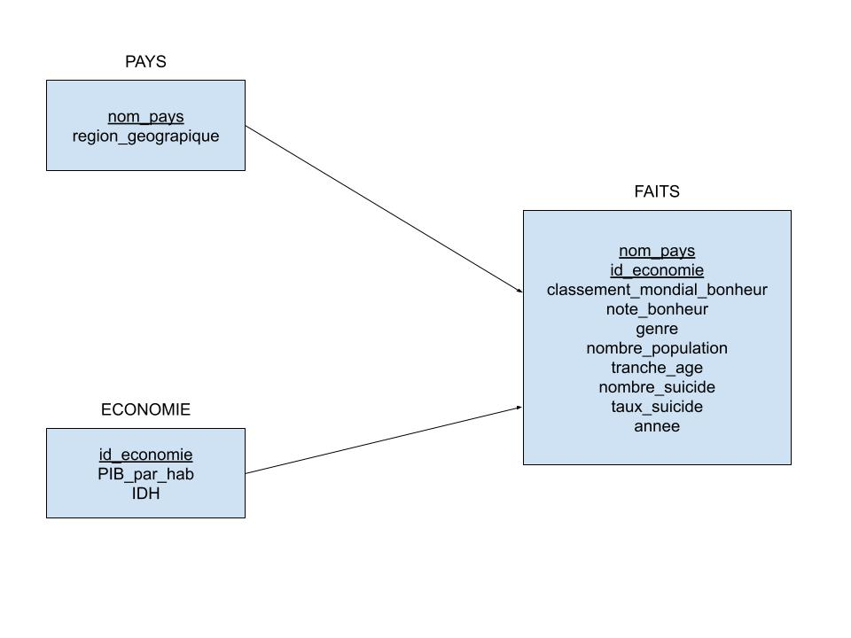

# **Bases de données évoluées - Projet 2021** #
## Etude du bien-être dans le monde en 2015 et 2016 ##

#### *Schéma en étoile de l'entrepôt de données* ####



Deux dimensions (PAYS et ECONOMIE) ainsi qu'une table des faits sont représentées dans ce schéma.  

- PAYS  
**nom_pays** (chaîne de caractère) : Nom du pays en toute lettre.  
**region_geographique** (chaîne de caractère) : Région géographique du pays concerné, en toute lettre.

- ECONOMIE  
**id_economie** (entier) : clé primaire necessaire pour différencier les différents tuples.  
**PIB_par_hab** (flottant) : le PIB/habitant.  
**IDH** (flottant) : valeur numérique comprise entre 0 et 1 qui représente l'IDH.  

- FAIT  
**classement_mondial_bonheur** (entier) : la position du pays de la population étudiée au classement mondial sur l'échelle du bonheur.  
**note_bonheur** (flottant) : valeur numérique comprise entre 0 et 10 qui représente le niveau de bonheur d'un pays selon ses habitants.  
**genre** (binaire) : Le genre de la population étudiée.    
**nombre_population** (entier) : taille de la population étudiée.  
**tranche_age** (chaîne de caractère) : tranche d'âge de la population étudiée.  
**nombre_suicide** (entier) : nombre de suicide dans l'année pour la population étudiée.  
**taux_suicide** (flottant) : nombre de suicide pour 100k habitants pour la population étudiée.  
**annee** (entier) : année concernée par les données.

#### *liste des requêtes* ####
- Group By
```sql
SELECT NOM_PAYS, SUM(NOMBRE_SUICIDE), SUM(POPULATION), AVG(TAUX_SUICIDE) as TX_SC 
FROM FAITS
GROUP BY NOM_PAYS
ORDER BY TX_SC DESC;
```
Affiche les pays avec les taux de suicide (pour 100 000 habitants) les plus élevées en premier (pour 2015-2016).
Cela donne un ordre de grandeur pour la suite des calculs.


- Group By Rollup 
```sql
SELECT ANNEE, NOM_PAYS, SUM(POPULATION) AS POPULATION_TOTALE, GROUPING(ANNEE) AS GRP
FROM FAITS
GROUP BY ROLLUP (ANNEE, NOM_PAYS)
ORDER BY NOM_PAYS;
```  
Calcule la population totale sur 3 niveaux d'aggrégats différent : 
  
-La population totale de chaque pays par année (2015 et 2016).  
*Utile à des fins d'analyse démographiques pour chaque pays*  
  
-La population totale répertoriée dans la base de donnée pour l'année 2015 et pour l'année 2016.  
*Utile pour connaitre le % de la population mondiale répertoriée dans la base de donnée et utile à des fins statistiques sur les données des suicides* 
  
-La somme de la population totale des années 2015 et 2016.  
*Utile à des fins statistiques sur les données des suicides*  


- Group By Rollup
```sql
SELECT FAITS.NOM_PAYS, REGION, AVG(TAUX_SUICIDE) AS AVG_SC
FROM FAITS, PAYS
WHERE FAITS.NOMP_PAYS = PAYS.NOM_PAYS
GROUP BY ROLLUP(REGION, FAITS.NOM_PAYS);
```
Ce calcul nous donne la moyenne sur 2015/2016 des taux de suicides par Pays puis par Région.
Cela est utile pour 

- Group By Cube
```sql
SELECT AVG(NOTE_BONHEUR), AVG(TAUX_SUICIDE), BONHEUR.ANNEE, BONHEUR.NOM_PAYS
FROM BONHEUR, FAITS
WHERE BONHEUR.NOM_PAYS = FAITS.NOM_PAYS
GROUP BY CUBE(BONHEUR.ANNEE, BONHEUR.NOM_PAYS);
```


- Group By 
```sql
SELECT CLASSEMENT_MONDIAL_BONHEUR, AVG(TAUX_SUICIDE) AS TX_SC, BONHEUR.NOM_PAYS, BONHEUR.ANNEE
FROM BONHEUR, FAITS
WHERE BONHEUR.NOM_PAYS = FAITS.NOM_PAYS
GROUP BY BONHEUR.NOM_PAYS, CLASSEMENT_MONDIAL_BONHEUR, BONHEUR.ANNEE
ORDER BY ANNEE, TX_SC;
```

- Ntile group by
```sql
SELECT RANK_IDH, AVG(TAUX_SUICIDE), AVG(IDH)
FROM(
    SELECT IDH, NTILE(4) OVER (ORDER BY IDH) RANK_IDH, TAUX_SUICIDE
    FROM FAITS, ECONOMIE
    WHERE FAITS.NOM_PAYS = ECONOMIE.NOM_PAYS
    )
GROUP BY RANK_IDH
ORDER BY RANK_IDH
```

- TOP ( rownum)
```sql
SELECT  * 
FROM(
    SELECT BONHEUR.NOM_PAYS, AVG(NOTE_BONHEUR) AS AVG_BON, AVG(TAUX_SUICIDE)
    FROM BONHEUR, FAITS
    WHERE BONHEUR.NOM_PAYS = FAITS.NOM_PAYS
    GROUP BY BONHEUR.NOM_PAYS
    ORDER BY AVG_BON
    )
WHERE ROWNUM < 10
```
ET SON OPPOSE 
```sql
SELECT  * 
FROM(
    SELECT BONHEUR.NOM_PAYS, AVG(NOTE_BONHEUR) AS AVG_BON, AVG(TAUX_SUICIDE)
    FROM BONHEUR, FAITS
    WHERE BONHEUR.NOM_PAYS = FAITS.NOM_PAYS
    GROUP BY BONHEUR.NOM_PAYS
    ORDER BY AVG_BON DESC
    )
WHERE ROWNUM < 10
```
- Group by

```sql
SELECT TRANCHE_AGE, AVG(TAUX_SUICIDE), ANNEE
FROM FAITS
GROUP BY (TRANCHE_AGE, ANNEE)
ORDER BY TRANCHE_AGE, ANNEE
```
